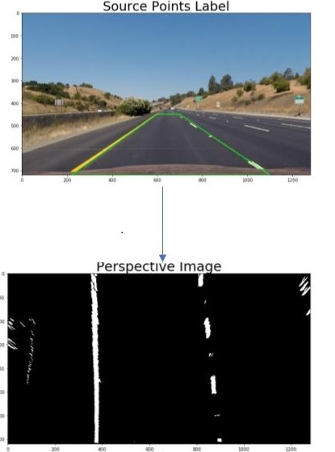
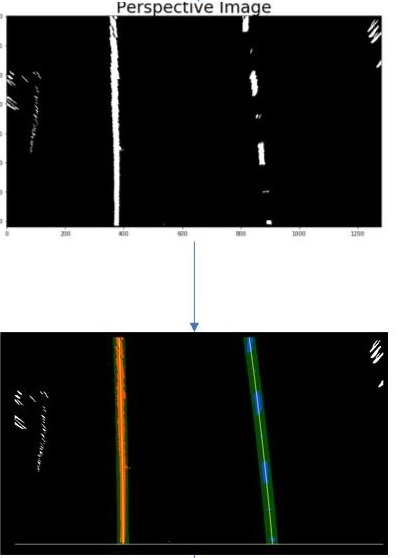

# Advanced lane finding  
---
In this project, my goal is to write a software pipeline to identify the
lane boundaries in a video from a front-facing camera on a car. 
The camera calibration images, test road images, and project videos are presented as output from the pipeline.


The goals / steps of this project are the following:

* Compute the camera calibration matrix and distortion coefficients given a set of chessboard images.
* Apply a distortion correction to raw images.
* Use color transforms, gradients, etc., to create a thresholded binary image.
* Apply a perspective transform to rectify binary image ("birds-eye view").
* Detect lane pixels and fit to find the lane boundary.
* Determine the curvature of the lane and vehicle position with respect to center.
* Warp the detected lane boundaries back onto the original image.
* Output visual display of the lane boundaries and numerical estimation of lane curvature and vehicle position.

[//]: # (Image References)
[image1]: ./documentation/distortion.png "Undistorted"
[image2]: ./documentation/image_processing.jpg "Image processing"
[image3]: ./documentation/filters.jpg "Image processing"
[image4]: ./documentation/perspective.jpg "Image Transformation"
[image5]: ./documentation/lane_find.jpg "Finding Lane lines"
[image5]: ./documentation/transformation.jpg "Image Transformation"
[image6]: ./documentation/output.png "Image Output"

---

### 1 Camera Calibration

#### 1.1 Camera matrix and Distortion coefficients
Brief description how the camera matrix and distortion coefficients are computed. 

The code for this step is contained in the in the following method: `utils.cal_undistort` (line:5 - line:10 `utils.py`).  
The input image is with the following dimension (1280, 720, 3)  
The number of corners by x and y are assumed to be (9, 6)  
I start by preparing "object points", which will be the (x, y, z) coordinates of the chessboard corners in the world.  
The code that computes object points and image points is contained in the following method : `utils.get_img_obj_points` (from line:13 - line:32 `utils.py`).  

Here I assumed the chessboard is fixed on the (x, y) plane at z=0, such that the object points are the same for each calibration image.  

Thus, `objp` is just a replicated array of coordinates, and `objpoints` will be appended with a copy of it every time I successfully detect all chessboard corners in a test image.  `imgpoints` will be appended with the (x, y) pixel position of each of the corners in the image plane with each successful chessboard detection.  

Then, I used the output `objpoints` and `imgpoints` to compute the camera calibration and distortion coefficients using the `cv2.calibrateCamera()` function.  I applied this distortion correction to the test image using the `cv2.undistort()` function and obtained this result:  


### 2 Pipeline (Test images)

#### 2.1 Example of applying undistortion on image
Distortion correction that was calculated via camera calibration has been correctly applied to each image. An example of a distortion corrected image is included below
![image1]


#### 2.2 Color transformation
Description about how I used color transforms, gradients or other methods to create a thresholded binary image. 

I used list of following filters 
* Absolute sobel threshold (x, y) direction  =>  Source:  `utils.py#sobel_filter` 
* RGB threshold on red and green colors => source `utils.py#rgb_filter` 
* YUV threshold on s-channel => source `utils.py#yuv_filter` 
* HSV threshold on s-channel => source `utils.py#hsv_filter`
* HLS threshold on s-channel and l-channel => source `utils.py#hls_filter`

#### 2.3 Pipeline (test images)
Describtion about how a perspective transform is performed on image with included example

The code for my perspective transform is located in function `perspective_transform`
Inside this function, there is a function called `warp_perspective`, which appears in lines 224, ref : `utils.py#perspective_transform`  The `warper` function takes as inputs an image (`img`), as well as source (`src`) and destination (`dst`) points.  I chose the hardcode for source points and destination points are depended on the image dimension.

```python
def get_source_points():
    return [[220,720], [1100, 720], [780, 470], [600, 470]]

def get_destination_points(width, height, fac=0.3):
    fac = 0.3
    p1 = [fac * width, height]
    p2 = [width - fac * width, height]
    p3 = [width - fac * width, 0]
    p4 = [fac * width, 0]
    destination_points = [p1,p2,p3,p4]
    return destination_points
```

This resulted in the following source and destination points:

| Source        | Destination   | 
|:-------------:|:-------------:| 
| 220, 720      | 384, 720        | 
| 1100, 720      | 896, 720      |
| 780, 470     | 896, 0      |
| 600, 470      | 384, 0        |

I verified that my perspective transform was working as expected by drawing the `source` and `destination` points onto a test image and its warped counterpart to verify that the lines appear parallel in the warped image.


<p align="center"> 

</p>


#### 2.4 Identifying lane line pixels and Polynomial fit

Once I applied calibration, thresholding, and a perspective transform to a road image, we have output binary output image with lines stand out clearly, as you can see on the picture above. 


* **If it's the very first frame:***
    * **Create white color hitogram** - *Source: (utils.py#get_lane_rectangles line:234 - line:236)*     
    *Note : We should not start from lane line close to the center, exclude these points from the histogram* 
    * **Generate 2 base window  points on left and right side where histogram 
      shows highest concentration of white colors** *Source : (utils.py#get_lane_rectangles line:244 - line:245)*  
    * **Foreach window** - *Source: (utils.py#get_lane_rectangles line:272 - line:307)*     
        * Store all the points contained inside the previous calculated windows and compute mean X-position for both windows 
        * Generate 2 windows аbove the previous 2 rectangles, with the computed mean X-position respectively.  
        
    * **Generate polynomial based on the stored points from left rectangles and stored points from right rectangles** - *Source : (utils.py#get_lane_rectangles line:326 - line:334)*     


* **For all other frames :** - *Source: (utils.py#get_next_frame_lines line:346 - line:326)*   
    * **Get the right and left polynomials that are calculated in the previous frame**
    *  **Store all points contained near defined offset from polynomial lines** - *Source : (utils.py#get_next_frame_lines line:360 - line:369)*
    *  **Generate polynomial based on the stored points from left rectangles and stored points from right rectangles** - * Source :(utils.py#get_next_frame_lines line:412 - line:418)*

Below is an example of identifying lane line pixels  

<p align="center"> 

</p>


#### 2.5 Radius of curvature and center offset 
Description how radius of curvature is calculated and the position of the vehicle with respect to center.

* **Radius of curvature calculation** - *Source : utils.py#get_curvature_radius (Line:177 - Line:191)*
 ```
    fit_cr = np.polyfit(ploty * ym_per_pix, x * xm_per_pix, 2)
    # Calculate the radius of curvature
    curverad = ((1 + (2 * fit_cr[0] * y_eval * ym_per_pix + fit_cr[1]) ** 2) ** 1.5) / np.absolute(2 * fit_cr[0])
```

Explanation : fit_cr[0], fit_cr[1], fit_cr[2] are the coeficients of second order polynomial scaled by meters per pixels factors (ym_per_pix, xm_per_pix)  
Once the parabola coefficients are obtained, in pixels, and we convert them into meters we can use the equation radius of curvature written above.

* **Offset from center calculation**  utils.py#get_offset_from_center (Line:194 - Line:200)*  
  First, we get the first two points (P1,P2) from the polinomyals representing the right and left lane at the bottom of the image.  
  Then, we calculate the X-axis average of P1 and P2  
  Finally, we calculate how much the calculated average differs from the center image width  
```
    lane_center = (right_x[height-1] + left_x[height-1]) / 2
    xm_per_pix = 3.7 / 700  # meters per pixel in x dimension
    img_center_offset = abs(width / 2 - lane_center)
    offset_metters = xm_per_pix * img_center_offset
    return offset_metters
```

#### 2.6 Example image of result

The fit from the rectified image has been warped back onto the original image and plotted to identify the lane boundaries. This  demonstrate that the lane boundaries were correctly identified. An example image with lanes, curvature, and position from center should be included in the writeup (or saved to a folder) and submitted with the project.

* Example image of result
![alt text][image6]

---

### Pipeline (video)

#### 1. Video Output
Here is a link to my final video output. The pipeline perform reasonably well on the entire project video 


| Project Video	|  Challenge Video |  Custom Video   |
|:-----------:|:----------:|:---------:|
| [](https://www.youtube.com/watch?v=OaEXivXLDf0)   	| [](https://www.youtube.com/watch?v=PnQ2Jzpkhqw)| [](https://www.youtube.com/watch?v=32Nd1bot3Uc) | 


---

### Discussion

#### 1. Briefly discuss any problems / issues you faced in your implementation of this project.  Where will your pipeline likely fail?  What could you do to make it more robust?

Here I'll talk about the approach I took, what techniques I used, what worked and why, where the pipeline might fail and how I might improve it if I were going to pursue this project further.  
